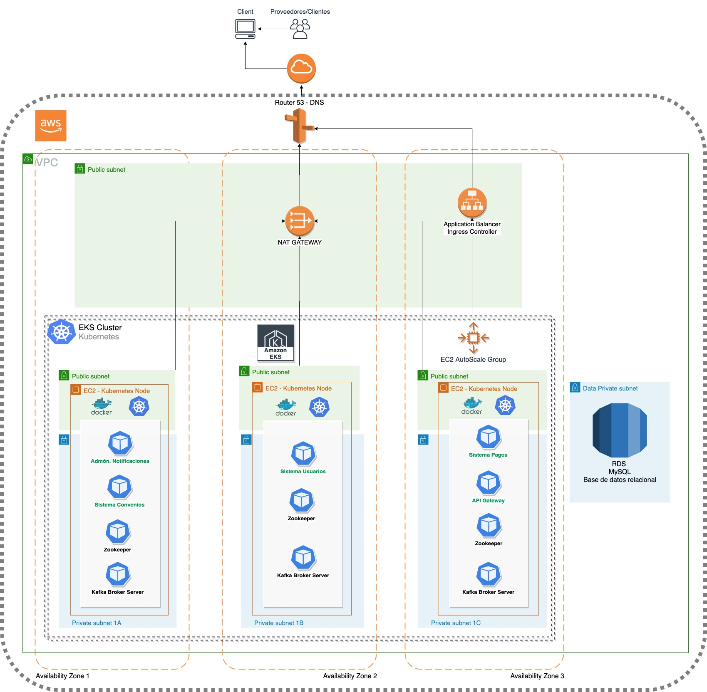

# Taller De Servicios de ModVal EAS


En este diagrama modelamos la solución del problema de pago de facturas de diferentes proveedores y que sea transparente el ingreso de un nuevo convenio de pago de facturas ya sea a través de servicios Rest o Soap.
Como podemos ver tendremos un único punto de acceso de las peticiones desde los diferentes canales de pago a través de un API gateway, este API hará el llamado a los servicios que tenemos expuestos para los clientes, que son la validación del cliente, la consulta del valor a cancelar de una factura por un convenio específico, o el pago de una factura por un convenio, en ambos casos se hace el llamado del servicio de validación del convenio, una vez se confirma el pago se hace el llamado con el servicio de pago al servicio expuesto por el proveedor para realizar el pago y con la confirmación o no del mismo haremos el llamado al proceso de notificaciones que tenemos a través de los servicios de Kafka, esté al recibir el mensaje lo direcciona a las colas que tiene para realizar el evento de notificación que hace el llamado a nuestro servicio de notificación que tenemos con el que se le enviara por correo electrónico la evidencia al cliente de la confirmación del pago de la factura de servicios.
Todos nuestro servicios tienen su propia base de persisitencia de datos.


<h2> Arquitectura </h2>


<h3>Microservicios</h3>
<p>Para el diseño e implementación se usó el estilo de arquitectura de microservicios porque nos permite cumplir con los requerimientos de escalabilidad, disponibilidad y seguridad requeridos. Lo anterior implica que cada servicio tenga un alto grado de granularidad en el manejo , ya que cada servicio está habilitando para ser escalable horizontalmente, desplegado independientemente, fácilmente mantenible y esto contribuye a su vez a  que la implementación y entrega de software sea más rápida y oportuna de acuerdo a los cambios del negocio o del mercado. </p>

<h3>Patrones de Colaboración/Composición entre Servicios</h3>
<p>La arquitectura implementa varios patrones de colaboración entre servicios, la mayoría de los microservicios implementan comunicación/composición a través de REST Síncronos, pero el módulo de notificaciones y pagos  implementan un patrón de colaboración a través de eventos coreográficos(asíncronos).</p>


<h2>Infraestructura Tecnológica</h2>
<p>La imagen a continuación representa todos los componentes físicos del sistema, así como las conexiones físicas de dichos  componentes y sus servicios. La plataforma fue desplegada en un ambiente cloud de AWS, en primera instancia porque no se cuenta con la infraestructura on-premise para desplegar todos los servicios propuestos, en ese sentido no sería posible cumplir con todos requerimientos funcionales y no funcionales. Adicional, se propone un estilo de arquitectura de micro servicios, el cual se adapta muy bien en un ambiente cloud ya que se puede aprovechar las características de seguridad, escalabilidad y elasticidad, entre otras características que un ambiente on-premise no puede ofrecer.</p>




<h3>Scripts Cloudformation</h3>
<p> Para el despliegue de la infraestructura se creó una serie de scripts en cloudformation, ya que nos facilita y agiliza el despliegue, el proceso completo toma aproximadamente 15 minutos. </p> 
<p><b>El siguiente link lo redireccionará a dichos scripts:</b></p>

[Definición de la Infraestrcutura](Infraestructura/aws_eks/README.md)


<h2>Deployment</h2>

<p>Los microservicios fueron desarrollados en Spring Boot empaquetados y desplegados sobre Kubernetes utilizando charts de Helm.</p> 

[Definición de la Infraestrcutura](TallerServicios/Apps/)


<h2>License</h2>

All the code in this repo is under 

```
MIT License

Copyright (c) 2019 
Byron Martinez Martinez bdmartinezm22@gmail.com
Edgard Javier Rivera  ejavier354@gmail.com
Jose Rafael Ocampo jocampo@gmail.com


Permission is hereby granted, free of charge, to any person obtaining a copy
of this software and associated documentation files (the "Software"), to deal
in the Software without restriction, including without limitation the rights
to use, copy, modify, merge, publish, distribute, sublicense, and/or sell
copies of the Software, and to permit persons to whom the Software is
furnished to do so, subject to the following conditions:

The above copyright notice and this permission notice shall be included in all
copies or substantial portions of the Software.

THE SOFTWARE IS PROVIDED "AS IS", WITHOUT WARRANTY OF ANY KIND, EXPRESS OR
IMPLIED, INCLUDING BUT NOT LIMITED TO THE WARRANTIES OF MERCHANTABILITY,
FITNESS FOR A PARTICULAR PURPOSE AND NONINFRINGEMENT. IN NO EVENT SHALL THE
AUTHORS OR COPYRIGHT HOLDERS BE LIABLE FOR ANY CLAIM, DAMAGES OR OTHER
LIABILITY, WHETHER IN AN ACTION OF CONTRACT, TORT OR OTHERWISE, ARISING FROM,
OUT OF OR IN CONNECTION WITH THE SOFTWARE OR THE USE OR OTHER DEALINGS IN THE
SOFTWARE.
```
_2020 - 2020 Bogotá - Colombia_


