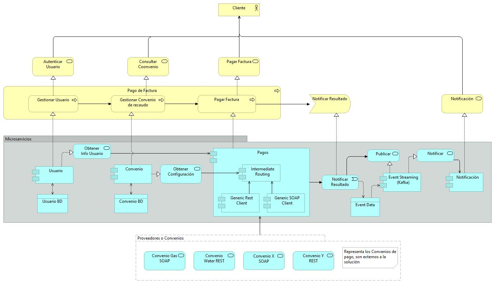

# Taller De Servicios de ModVal EAS


En este diagrama se modela la solución del problema de pago de facturas de diferentes proveedores, los cuales se pueden adicionar a través del esquema
de configuración registrando los servicios que ellos exponen, para la consulta, pago y compensación de facturas, indiferentemente de si los servicios
se exponen a través de REST o SOAP. 

Como se puede observar se tiene un único punto de acceso de las peticiones desde los diferentes canales de pago a través de un API gateway, este API expone
las capacidades de Consulta, Pago y Compensación de Facturas que se tienen expuestas para los clientes, las cuales a su vez son redireccionadas al proveedor
del servicio correspondiente a través una funcionalidad que implementa el patrón <strong> Intermediate Routing </strong> que permite invocar al servicio correspondiente
de acuerdo al proveedor de servicio seleccionado por el cliente al momento de realizar la transacción.

Se desarrollaron 4 microservicios, uno denominado <b>Usuario</b>, permite la gestión del registro de usuarios del sistema, el de <b>Convenios</b>, para la gestión de la 
información de los proveedores de servicios, dentro de éste también se permite el registro de la configuración de los servicios que expone cada proveedor. el Servicio 
de <b>Pagos</b> que es el que expone las funcionalidad hacia el cliente para la consulta, pago o compensación de una factura, y el servicio de <b>Notificación</b> encargado
de enviar la notificación del resultado de la transacción al cliente por correo electrónico.

En la siguiente gráfica se ilustra el proceso de pago, donde un usuario que desea realizar un pago, inicia autenticándose a través del microservicio de <b>Usuario</b>, luego
consulta la información de los convenios de recaudo activos a través del micro servicio <b>Convenio</b>, invoca el servicio de pagar factura, implementado por el microservicio
<b>Pago</b> Este servicio a utiliza la estrategia de <b>orquestación</b> para invocar los servicios de <b>Usuario</b> para taer la información del cliente que está realizando
la transacción, y de <b>Convenio</b> para obtener la configuración y la ruta para invocar el servicio del proveedor correspondiente que a su vez también hace parte de
esta <b>orquestación</b>, una vez se obtiene la respuesta del servicio del proveedor, se hace envía el evento de notificación de la respuesta a través de Kafka  de forma
asíncrona, para que el servicio de notificaciones envíe el correo <b> Coreografía </b>




<h2> Arquitectura </h2>


<h3>Microservicios</h3>
<p>Para el diseño e implementación se usó el estilo de arquitectura de microservicios porque nos permite cumplir con los requerimientos de escalabilidad, disponibilidad y seguridad requeridos. Lo anterior implica que cada servicio tenga un alto grado de granularidad en el manejo , ya que cada servicio está habilitando para ser escalable horizontalmente, desplegado independientemente, fácilmente mantenible y esto contribuye a su vez a  que la implementación y entrega de software sea más rápida y oportuna de acuerdo a los cambios del negocio o del mercado. </p>

<h3>Patrones de Colaboración/Composición entre Servicios</h3>
<p>La arquitectura implementa varios patrones de colaboración entre servicios, la mayoría de los microservicios implementan comunicación/composición a través de REST Síncronos, pero el módulo de notificaciones y pagos  implementan un patrón de colaboración a través de eventos coreográficos(asíncronos).</p>

<h3>Principio del "Contrato Primero"</h3>
Para cada uno de los servicios implementados, se definió primero el contrato basados en la especificación OpenAPI 3.0.3, los contratos de los servicios se pueden encontrar
en a continuación:

[Contrato Servicio Convenios yaml](Contracts/Convenios.yaml)  ==>  [Vista html](https://htmlpreview.github.io/?Contracts/Convenios.html)<br/>
[Contrato Servicio Usuarios yaml](Contracts/Usuario.yaml)  ==> [Vista html](https://htmlpreview.github.io/?Contracts/Usuarios.html) <br/>
[Contrato Servicio Pagos yaml](Contracts/PagoDispatcher.yaml) ==> [Vista html](https://htmlpreview.github.io/?Contracts/Pagos.html)


<h2>Infraestructura Tecnológica</h2>
<p>La imagen a continuación representa todos los componentes físicos del sistema, así como las conexiones físicas de dichos  componentes y sus servicios. La plataforma fue desplegada en un ambiente cloud de AWS, en primera instancia porque no se cuenta con la infraestructura on-premise para desplegar todos los servicios propuestos, en ese sentido no sería posible cumplir con todos requerimientos funcionales y no funcionales. Adicional, se propone un estilo de arquitectura de micro servicios, el cual se adapta muy bien en un ambiente cloud ya que se puede aprovechar las características de seguridad, escalabilidad y elasticidad, entre otras características que un ambiente on-premise no puede ofrecer.</p>


<h3>Scripts Cloudformation</h3>
<p> Para el despliegue de la infraestructura se creó una serie de scripts en cloudformation, ya que nos facilita y agiliza el despliegue, el proceso completo toma aproximadamente 15 minutos. </p> 
<p><b>El siguiente link lo redireccionará a dichos scripts:</b></p>

[Definición de la Infraestrcutura](Infraestructura/aws_eks/README.md)


<h2>Deployment</h2>

<p>Los microservicios fueron desarrollados en Spring Boot empaquetados y desplegados sobre Kubernetes utilizando charts de Helm.</p> 

[Charts Helm](Apps/)

<p>Para facilitar la instalación y el deployment de todos los servicios, incluyendo Kafka y Zookeeper, creamos el siguiente script. Es decir, después del despliegue de la infraestructura se debería correr este script. Este script se apoya de helm y kubectl, por lo que es importante tener estas dos herramientas instaladas y configuradas correctamente.</p>

[Charts Helm](Apps/startup-apps.sh)

<h2>License</h2>

All the code in this repo is under 

```
MIT License

Copyright (c) 2019 
Byron Martinez Martinez bdmartinezm22@gmail.com
Edgard Javier Rivera  ejavier354@gmail.com
Jose Rafael Ocampo jocampo@gmail.com


Permission is hereby granted, free of charge, to any person obtaining a copy
of this software and associated documentation files (the "Software"), to deal
in the Software without restriction, including without limitation the rights
to use, copy, modify, merge, publish, distribute, sublicense, and/or sell
copies of the Software, and to permit persons to whom the Software is
furnished to do so, subject to the following conditions:

The above copyright notice and this permission notice shall be included in all
copies or substantial portions of the Software.

THE SOFTWARE IS PROVIDED "AS IS", WITHOUT WARRANTY OF ANY KIND, EXPRESS OR
IMPLIED, INCLUDING BUT NOT LIMITED TO THE WARRANTIES OF MERCHANTABILITY,
FITNESS FOR A PARTICULAR PURPOSE AND NONINFRINGEMENT. IN NO EVENT SHALL THE
AUTHORS OR COPYRIGHT HOLDERS BE LIABLE FOR ANY CLAIM, DAMAGES OR OTHER
LIABILITY, WHETHER IN AN ACTION OF CONTRACT, TORT OR OTHERWISE, ARISING FROM,
OUT OF OR IN CONNECTION WITH THE SOFTWARE OR THE USE OR OTHER DEALINGS IN THE
SOFTWARE.
```
_2020 - 2020 Bogotá - Colombia_


